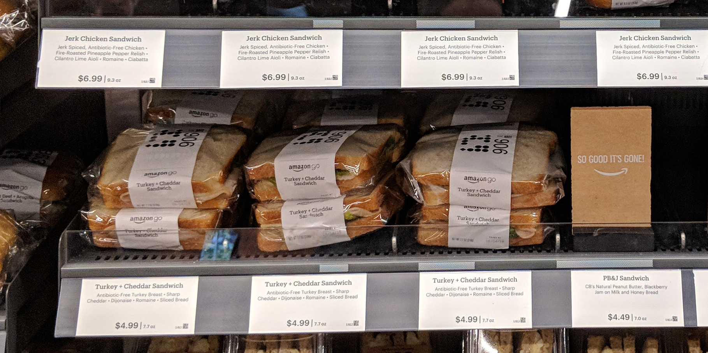
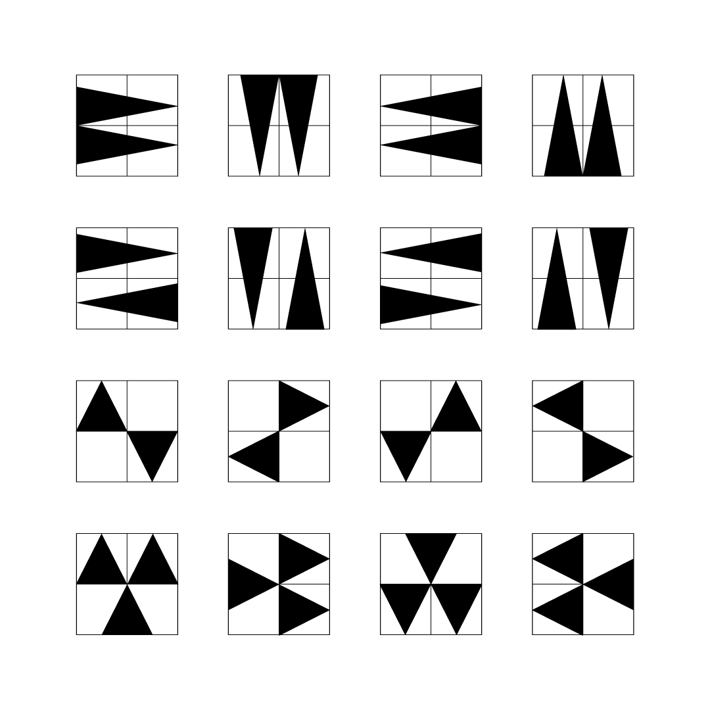
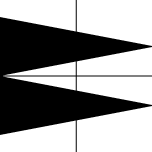
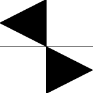
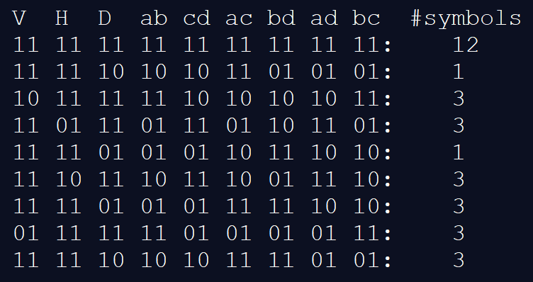
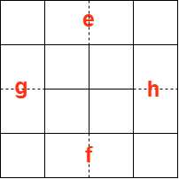
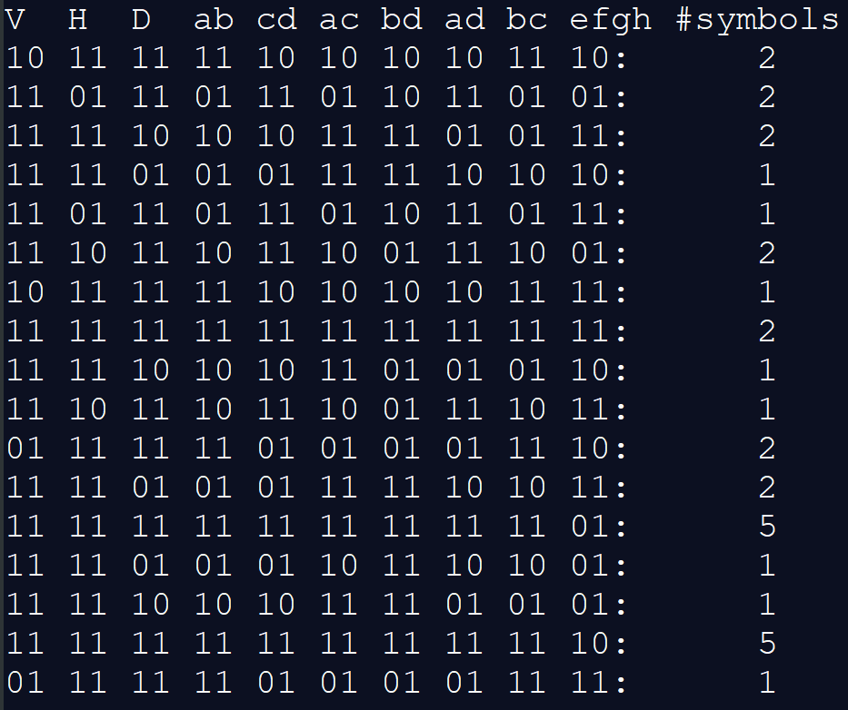

# SymCode: The Symbolic Barcode for Humans and Machines

## Summary

This is our story in the design and implementation of a symbolic barcode system, and our reflection after the project.

## Motivation

If you are lucky enough to live in a place where an Amazon Go store is nearby, you definitely should visit it. It is packed full of esoteric technology that enthusiast like us get super intrigued. One item that caught our eyes was the labels on the salad and sandwiches in the ready-made food section.


> Photo by Sikander Iqbal, [CC BY-SA 4.0](https://creativecommons.org/licenses/by-sa/4.0), via [Wikimedia Commons](https://commons.wikimedia.org/wiki/File:Amazon_Go_-_Seattle_(20180804111213).jpg)

There printed a matrix of cute little circles and squares! It must be a barcode of some sort. From our observation, there are always three diamonds on each label, which can be placed at anywhere on the 6x4 matrix. The circles are the bits of the barcode, so we can assume that the barcode can encode 24 bit raw data.

Our attempt to decipher the 'Amazon Reversi Code' was futile, but this is the start of the story.

## Background

A bit of context for the unfamiliar reader, the name Barcode is referring to the labels we still find in virtually every packaged products today. Barcode encode data by varying the widths and spacings of the vertical bars, which are to be scanned by a laser beam crossing horizontally. With the advent of image sensors, 2D barcodes were developed, where QR code and Aztec Code are some of the most well-known.

In general, 2D barcode scanner works as follows:

1. Locate the finders. These finders act as a trigger to tell the scanner that 'here is a barcode!'. The finders have to be easily detectable yet not interfering with the data modules.
2. Attempt to scan and read metadata surrounding the finder candidates. The metadata usually includes a format code and timing patterns.
3. If the previous step succeeds, the scanner would sample the entire barcode to construct a raw bit string. A checksum operation is done to detect errors.
4. If the previous step succeeds, the payload is extract from the raw bits, which usually involves some bit masking and shuffling.

This framework has aged well and they are quite robust and low-cost to implement in embedded systems. However, they are meant to be read by machines and not by our naked eyes. They are not designed for aesthetics and are impossible for humans to comprehend.

## Goals and Constraints

Our goal is to design a barcode system that are both human-readable and machine-readable. We now turn our attention to human readability by studying human languages.

Machines run on bits, so we can say the alphabet consists of 0 and 1. In human languages, we have a larger set of alphabets. In English, we have 26 distinct lowercase letters. In Korean, characters are constructed by composing 2 to 6 elements from a set of 40 distinct Jamo.

There is a direct tradeoff between information density and visual ambiguity. If the symbol set is too large, humans would have difficulty in remembering all of them. In addition, there may be some visually similar symbols that are hard to disambiguate. If the symbol set is too small, the same message has to be encoded with more symbols, which again, humans often have a hard time in processing long strings.

We determined that a symbol set in the range of 16 to 64 symbols is a good balance.

## Design of symbols

What makes good symbols?

1. Prominence
   First, the symbols have to stand out from the natural world, to manifest that they are created deliberately to convey a message but not a result of some natural phenomenon.
2. Repeatable
   Symbols are constructed with specific tools and processes that can be taught to other people. The meaning of a symbol should remain the same when reproduced, in which variation is tolerated.
3. Distinctive
   Symbols within a set should not be similar with each other and have distinctive features allowing the reader to resolve ambiguity between symbols.
4. Aesthetics
   Finally, good symbols should observe the aesthetics rules of the human eye, including being anti-symmetric, rotational symmetric, balanced and consistent. As a pointer, the [Gestalt Principles]([Gestalt psychology - Wikipedia](https://en.wikipedia.org/wiki/Gestalt_psychology)) are fantastic rules of thumb.

With the above rules in mind, we designed a minimalistic symbol set. Each symbol is composed of multiple triangles, the basic geometric primitive. Each symbol is symmetric or anti-symmetric in overall, but exhibits asymmetry internally. They are like Tangram, in which a human child can easily reproduce the symbols by assembly some triangular pieces together.

The next section would quantitatively analyze and justify this design methodology.

## Trace of shapes

The naive way to match a shape against a symbol set is to perform a linear search, XOR it with every symbol and then chooses the one with the lowest delta. It works in principle, but is inefficient. Ideally, an algorithm can condense a complex shape into a feature vector, which we can lookup in the feature space of the symbol set for the nearest neighbour and arrive to a match.

Instead of using an array of real numbers, we devised that an array of bits are sufficient to capture the essence of symbols, and from now on we refer this bit string as 'trace'.

### The English alphabet

Now, let us take a closer look at the lowercase English alphabet set to illustrate this idea.

[diagram]

First off, we can classify the 26 alphabets as either tall or short, giving:
```
Tall: b d f g h j k l p q t y
Short: a c e i m n o r s u v w x z
```

Next, we can divide the letter into two halfs horizontally and compare their weights:
```
Left > right: b c f h k p r t y
Left < right: a d g q
Left ~ right: e i j l m n o s u v w x z
```

Then, we can divide the letter into two halfs vertically and compare their weights:
```
Up > down: f m n p q r y
Up < down: b d h k u
Up ~ down: a c e g i j l o s t v w x z
```

At this point, we had the following:
```
a: SR=
b: TLD
c: SL=
d: TRD
e: S==
f: TLU
g: TR=
h: TLD
i: S==
j: T==
k: TLD
l: T==
m: S=U
n: S=U
o: S==
p: TLU
q: TRU
r: SLU
s: S==
t: TLD
u: S=D
v: S==
w: S==
x: S==
y: TLU
z: S==
```

Group by trace:
```
SR=: a
TLD: b h k
SL=: c
TRD: d
S==: e i o s v w x z
TL=: t
TR=: g
T==: j l 
S=U: m n
TLU: f p y
TRU: q
SLU: r
S=D: u
```

Which is a surprisingly good classifier using only three comparisons. We can do more trinary comparisons on smaller partitions to further differentiate the collisions, but our investigation on English alphabets ends here for the scope of this article.

### SymCode

Our trace for SymCode symbols follows a similar scheme:

> For illustration purpose, we are using a subset of Acute32, a symbol set we designed specifically for SymCode. A grid of 4 squares is put behind each symbol.
>
> The complete alphabet of Acute32 is available in the next section.



This symbol subset is in fact the first prototype alphabet that we used to test and debug the most basic version of the scanner.

In early stage of development, we defined the symbol traces using only three comparisons (shape/weight analyses), namely vertical, horizontal, and diagonal comparisons.

> If the "number of dots" in each of the four quadrants of a symbol (in order of top-left, top-right, bottom-left, bottom-right) are denoted by non-negative quantities a,b,c,d respectively, the three comparisons are defined as follows:
>
> * Vertical comparison = (a+b) vs (c+d) // Top vs Bottom
> * Horizontal comparison = (a+c) vs (b+d) // Left vs Right
> * Diagonal comparison = (a+d) vs (b+c) // Backslash vs Slash

Below are two examples:



* Vertical comparison = Top ~ Bottom
* Horizontal comparison = Left > Right
* Diagonal comparison = Backslash ~ Slash



* Vertical comparison = Top ~ Bottom
* Horizontal comparison = Left ~ Right
* Diagonal comparison = Backslash > Slash

Each comparison gives **3 possible outcomes (<, >, ~)**. For simplicity, we assign **2 bits** to encode each comparison. Therefore, this naive implementation uses 3 * 2 = **6 bits** to store each trace.

The above worked well enough for the basic symbol subset shown in the beginning of the section, but it was found ineffective after we doubled the alphabet size. The extended alphabet, which was later named as Acute32, required an extension on the trace definition.

## Trace of Acute32

> This section focuses on discussing the theory of trace in Acute32. How it is actually used in the pipeline to facilitate searching is considered to be implementation detail and can be found in the next section under the Recognizer stage.

As the number of symbols grows, more and more traces inevitably collide. This of course depends on aesthetical requirements and the creativity of the designers. We are combating an engineering problem here - it is a trade-off between alphabet size and decoding efficiency.

If you are looking to design your own alphabet, trace collisions should really be one of the major concerns. Remember: the worst case scenario is having to run a linear scan in the library for each input shape!


In Acute32 (above), traces collide. Our engineering solution is to simply define the traces with more comparisons. Apart from the three basic comparisons explained in the previous section, we also compare every pair of the four quadrants (each quadrant is compared to every other quadrant exactly once), requiring **an extra of 4 choose 2 = 6 comparisons**.

> ##### Adding extra comparisons
>
> It is important to note that **not any arbitrary extra comparisons** are effective. The rule of thumb is each extra comparison should introduce new information than the existing ones, making them **(at least partially) independent** of each other. In general, comparisons that use **different numbers of blocks** should be independent. For example, in the previous section all comparisons used 2 blocks vs 2 blocks, so the extra ones in this section, which use 1 block vs 1 block, are all (partially) independent of the previous ones. This is because as more blocks are being considered at once, the scope of analysis becomes irreversibly broader - just like how you cannot retrieve neither x nor y from the sum (x+y).

Adding the extra ones results in a total of 3 + 6 = 9 comparisons. Using 2 bits to encode each, we are using 9 * 2 = **18 bits** to store each trace in Acute32.

Below is the distribution of traces for Acute32:

> Denote a comparison operation by "U vs V". The vertical, horizontal, and diagonal comparisons become "Top vs Bottom", "Left vs Right", and "Backslash vs Slash" respectively. The rest of the comparisons become "a vs b", "c vs d", and so on. We set the bits as follows:
>
> ##### For each comparison U vs V
>
> * 11 means "U ~ V"
> * 10 means "U > V"
> * 01 means "U < V"
> * 00 is invalid



### Further improvement

The trace of all 1's, which happens when all four quadrants of the symbol share (approximately) the same number of dots, represents about one-third of the entire Acute32. This makes approximately one-third of the searches scan through 12 symbol images, which is 4 times that of most of the rest, which only scan through 3 symbol images.

Our solution here is once again adding more comparisons... well, it turns out only one extra comparison suffices.



We further partition the grid of each symbol image so that there are 4x4 = 16 small blocks, and denote the top/bottom/left/right blocks along the edge by e,f,g,h respectively, as illustrated in the figure above. Next, we define an "ef/gh comparison" which is essentially (e+f) vs (g+h) using the previously defined comparison operation notation. 

Now we have a relatively balanced partition.



Of course it can be further optimized by defining even more comparisons, but we settle for this result for the sake of illustration here.

### Robustness

Another important thing to note is that traces, in both construction (evaluating for templates in symbol library) and application (evaluating for input shape when scanning), should allow **tolerances** (the *stat_tolerance* parameter in *Acute32SymcodeConfig*. This is to provide an elastic net to enhance robustness against noisy inputs.

### Conclusion

The trace partitions the character sets into smaller, mutually-exclusive subsets. Provided that **searching through traces is faster than searching through the actual symbols** (there are various ways to implement this, such as hash tables or decision trees, but **even a linear scan over the traces is already much faster than a linear scan over the symbols by image XOR**), traces facilitate symbol comparison in the library.

In the next section, we are going to look into the engineering of the image processing pipeline of SymCode and how it is implemented for Acute32.

## Image Processing Pipeline

[Sanford]

## AcuteCode and ReversiCode

We developed a theoretic as well as a programming framework for designing and implementing symbolic barcodes. The programming library is available as `symcode`. For those who simply want to integrate SymCode into your existing application, please refer to the wasm distribution which is ready to use in any browser based Javascript projects.

## About Vision Cortex

>  "Like everything metaphysical the harmony between thought and reality is to be found in the grammar of the language." - Ludwig Wittgenstein

Communication is metaphysical. Communication between two humans is a language game. Communication between humans and machines in a purely visual manner is a complex language game. The syntax of the language is shapes, the grammar of the language is the spatial configuration, the semantics of the language is the meaning conveyed by these symbols.

This story is a manifest of the philosophy behind Vision Cortex, and a glimpse of the ongoing research and development by the Vision Cortex Research Group.

If you enjoyed the reading and appreciate our work, consider starring (on GitHub), discuss (on Reddit / GitHub), share (on Twitter / everywhere), contribute.
